# 🛡️ Autonomous Compliance Auditor

<div align="center">

[](https://www.python.org/)
[](https://github.com/google/adk-python)
[](https://ai.google.dev/)
[](https://streamlit.io/)
[](https://www.docker.com/)

**An enterprise-grade multi-agent system that autonomously audits documents, detects risks via Hybrid RAG, and enforces Human-in-the-Loop safety.**

</div>

---

## 📸 Live Dashboard


---

## 📑 Table of Contents
- [Overview](#-overview)
- [Key Features](#-key-features)
- [Architecture](#-architecture-flow)
- [Technical Deep Dive](#-technical-deep-dive-the-hybrid-brain)
- [Repository Structure](#-repository-structure)
- [Getting Started](#-getting-started)
- [License](#-license)

---

## 📖 Overview
The **Autonomous Compliance Auditor** transforms the slow, manual process of legal document review into a high-speed, AI-driven pipeline. Instead of relying on simple keyword matching, it employs a **Hybrid RAG** approach (Vector + Keyword + Re-ranking) to understand complex legal nuance.

Critically, it features a **Human-in-the-Loop (HITL)** guardrail: high-severity risks trigger a system freeze, requiring explicit human approval before the report is finalized.

---

## ⚡ Key Features

| Feature | Tech | Description |
| :--- | :--- | :--- |
| 🧠 **Hybrid Brain** | **FAISS + BM25** | Combines vector & keyword search with **Cross-Encoder Re-Ranking** for precise policy retrieval. |
| 👁️ **Agentic Vision** | **Gemini Vision** | Transcribes scanned contracts, charts, and images that standard parsers miss. |
| 🛑 **Safety Guardrail** | **HITL** | **Stops execution** on high-severity risks until a human admin approves via UI. |
| 🔄 **Self-Healing** | **Reflection Loop** | If a finding is rejected, the agent automatically re-analyzes the document. |
| 🕵️ **Orchestration** | **Google ADK** | Coordinates 5 agents: *Ingestion, Classification, Analysis, Evidence, Reporting*. |

---

## 🔄 Architecture Flow

The system uses a **Loop-and-Gate** pattern to ensure accuracy and safety.

```mermaid
graph TD
    Start[🚀 Start Audit] --> Ingest[🕵️ Ingestion Agent]
    Ingest --> Classify[🧐 Classification Agent]
    
    subgraph "Perception Layer"
    Classify -- Image --> Vision[👁️ Vision Tool]
    Classify -- Text --> File[📄 File Reader]
    end

    Vision --> Analyze[⚖️ Analysis Agent]
    File --> Analyze
    
    subgraph "Cognitive Loop"
    Analyze <-->|Hybrid RAG Query| DB[(Policy DB)]
    Analyze --> Evidence[🕵️‍♂️ Evidence Agent]
    Evidence -- Reject --> Analyze
    end
    
    Evidence -- Verify --> Gate{Severity?}
    Gate -- High --> HITL[🛑 Human Approval]
    Gate -- Low --> Report[📝 Reporting Agent]
    HITL --> Report
    
    Report --> Email[📧 Email User]
    Report --> UI[🖥️ Update Dashboard]

    style HITL fill:#b71c1c,stroke:#fff,color:#fff
    style Analyze fill:#0d47a1,stroke:#fff,color:#fff
```


## 🔬 Technical Deep Dive: The "Hybrid Brain"

**The Problem:** Legal analysis requires *both* exact references (e.g., "Section 4.2") and semantic understanding (e.g., "Breach" = "Incident"). Standard RAG fails at this duality.

**The Solution:** A 3-Stage Pipeline for maximum precision.

```mermaid
graph LR
    Q[User Query] --> A[🔍 BM25 Keywords]
    Q --> B[📐 FAISS Vectors]
    A & B --> C{🌪️ Fusion Pool}
    C --> D[⚖️ Cross-Encoder]
    D --> E[🎯 Top Evidence]
    
    style D fill:#ffeba3,stroke:#fbc02d,stroke-width:2px
```


| Stage	| Action | Technology| 
| :--- | :--- | :--- |
| 1. Retrieval	| Parallel fetch of Concepts (Vectors) and Exact Terms (Keywords).| FAISS + Rank_BM25| 
| 2. Fusion | 	Combine diverse results into a unified candidate pool.	| Ensemble Retrieval| 
| 3. Re-Ranking| 	A dedicated model scores every candidate pair to pick the single best match.| 	Cross-Encoder (ms-marco)| 

---

## 📂 Repository Structure

```text
Autonomous-Compliance-Auditor/
├── agents/                     # The 5 Specialized AI Agents
│   ├── ingestion_agent.py      # Scans Drive/URLs & batches jobs
│   ├── classification_agent.py # Identifies doc type (Contract vs Policy)
│   ├── analysis_agent.py       # Core logic: Hybrid RAG & Risk Detection
│   ├── evidence_agent.py       # QA Auditor: Verifies findings & triggers HITL
│   └── reporting_agent.py      # Generates Markdown report & sends Email
│
├── tools/                      # Custom Tools & MCPs
│   ├── google_drive_tool.py    # Google Drive API integration
│   ├── file_reader_tool.py     # text/pdf/docx parser
│   ├── web_scraper_tool.py     # URL content extractor
│   ├── rag_tool.py             # Hybrid Search (FAISS + BM25 + Re-Ranker)
│   ├── vision_tool.py          # Gemini Vision (OCR) for images
│   └── notification_tool.py    # Gmail API integration
│
├── knowledge_base/             # Source Policy Documents (PDFs/TXTs)
│
├── screenshots/                # Project Demo Images
│   ├── dashboard-main.png
│   ├── hitl-warning.png
│   └── ...
│
├── tests/                      # Unit & Integration Tests
│   ├── test_agent1.py
│   ├── ...
│   └── test_vision.py
│
├── app.py                      # Streamlit Frontend Dashboard
├── main.py                     # CLI Orchestration Script
├── run_indexing.py             # Vector DB Builder Script
├── create_sample_image.py      # Helper to generate test images
├── models.py                   # Gemini Model Configuration (Retry Logic)
├── chunk_metadata.json         # RAG Metadata
├── knowledge.index             # FAISS Vector Index
├── requirements.txt            # Python Dependencies
└── .gitignore
```

## Workflow Gallery 

<div align="center">
  <h3>Screenshots</h3>
  <table border="0" cellspacing="10" cellpadding="10">
    <tr>
      <td align="center">
        <strong>Risk Detected</strong><br><br>
        
      </td>
      <td align="center">
        <strong>HITL Guardrail</strong><br><br>
        
      </td>
    </tr>
    <tr>
      <td align="center">
        <strong>Final Report</strong><br><br>
        
      </td>
      <td align="center">
        <strong>Delivery</strong><br><br>
        
      </td>
    </tr>
  </table>
</div>

## 🛠️ Tech Stack

This project is built with a robust, enterprise-grade stack of tools and libraries:

<p align="center">
  <a href="https://www.python.org" target="_blank">
    
  </a>
  <a href="https://github.com/google/adk-python" target="_blank">
    
  </a>
  <a href="https://streamlit.io" target="_blank">
    
  </a>
  <a href="https://ai.google.dev/" target="_blank">
    
  </a>
  <a href="https://www.docker.com/" target="_blank">
    
  </a>
  <a href="https://github.com/facebookresearch/faiss" target="_blank">
    
  </a>
  <a href="https://huggingface.co/" target="_blank">
    
  </a>
</p>

## 🚀 Getting Started

### 1️⃣ Prerequisites
* **Python 3.10+**
* **Google Cloud Project** with **Drive API** and **Gmail API** enabled.
* **Google AI Studio API Key** (for Gemini 2.5 Flash).

### 2️⃣ Installation

1.  **Clone the repository:**
    ```bash
    git clone [https://github.com/yourusername/autonomous-compliance-auditor.git](https://github.com/yourusername/autonomous-compliance-auditor.git)
    cd autonomous-compliance-auditor
    ```

2.  **Create and activate a virtual environment:**
    ```bash
    # Create the environment
    python -m venv venv

    # Activate on Windows
    .\venv\Scripts\activate
    
    # Activate on macOS/Linux
    source venv/bin/activate
    ```

3.  **Install the required packages:**
    ```bash
    pip install -r requirements.txt
    ```

4.  **Set up Configuration:**
    * Create a `.env` file in the root directory:
        ```ini
        GEMINI_API_KEY="your_google_ai_studio_key"
        ```
    * Place your `credentials.json` (Google OAuth Client ID) in the root folder.

## Usage

1.  **Build the Knowledge Base:**
    Run the indexer to vectorize your policy documents (PDF/TXT in `knowledge_base/`):
    ```bash
    python run_indexing.py
    ```

2.  **Launch the Dashboard:**
    Start the Streamlit application:
    ```bash
    streamlit run app.py
    ```

3.  **Access the App:**
    Open your web browser to the local URL provided (usually `http://localhost:8501`).

4.  **Run an Audit:**
    * Enter a **Google Drive Folder ID** or **Web URL** in the sidebar.
    * Click **"🚀 Start Audit Pipeline"**.
    * Watch the agents ingest, classify, and analyze files in real-time.
    * **Approve/Reject** high-severity risks when the Human-in-the-Loop guardrail activates.

## Documents Tested

This system has been successfully tested on complex enterprise documents, including:
-   `Internal_Data_Policy.docx` (Text-based policies)
-   `Scanned_Vendor_Contract.png` (Image-based contracts requiring OCR)
-   `Google_Privacy_Policy.html` (Live web URLs)

## 📄 License

This project is licensed under the **MIT License**.
